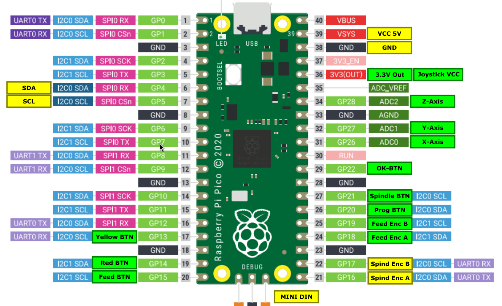

# Estlcam Handrad

Estlcam Handrad Umsetzung mit Raspberry Pi Pico. Es wurde das von Estlcam veröffentlichte Protokoll umgesetzt. Das Handrad läuft mit der offiziellen Hardware von Estlcam (LPT Adapter und Klemmenadapter) .

Da der Pi Pico nur 3 nutzbare ADC Kanäle hat, wurden *Feed* und *Spindle* über Drehencoder realisiert.

Buttons für *OK*, *SPINDLE* und *PROG* wurden umgesetzt.

Die Knöpfe *YELLOW*, *RED* und *FEED* sind noch unbelegt.

## Protokoll:

https://www.estlcam.de/DIN_Detail.php

## Pinout:

## Links:

Estlcam LPT / Parallelport Adapter:

https://www.estlcam.de/lpt_adapter.php

Estlcam Klemmenadapter:

https://www.estlcam.de/Klemmenadapter.php
 

Vorlage für Gehäuse:

https://blog.altholtmann.com/diy-cnc-handrad-mit-joystick/
